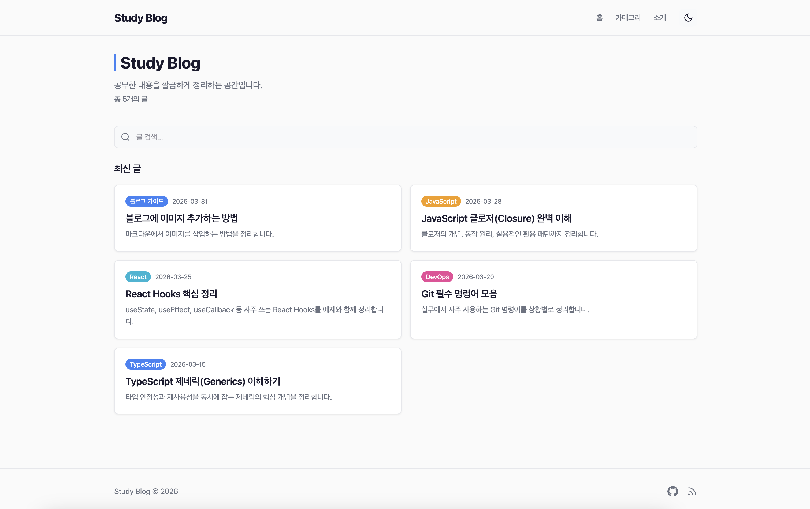

# study-blog

> 개발 공부 기록을 위한 마크다운 기반 정적 블로그

[](https://nextjs.org/)
[](https://www.typescriptlang.org/)
[](https://tailwindcss.com/)
[](https://vercel.com/)



---

## ✨ Features

- **다크/라이트 모드** — 부드러운 전환 애니메이션 포함
- **실시간 클라이언트 사이드 검색** — 별도 서버 요청 없이 즉시 필터링
- **자동 생성 목차(TOC)** — 데스크톱에서 사이드바로 표시, 헤딩 기반 자동 추출
- **읽기 진행 바** — 스크롤 위치를 상단 바로 시각화
- **코드 블록 복사 버튼** — 클릭 한 번으로 코드 복사
- **읽기 시간 추정** — 분당 200단어 기준 자동 계산
- **이전/다음 글 네비게이션** — 날짜순 인접 포스트 이동
- **관련 글 추천** — 동일 카테고리 기반 최대 3개 표시
- **카테고리 색상 시스템** — JavaScript, React, TypeScript 등 카테고리별 고유 색상
- **RSS 피드** — `/feed.xml` 엔드포인트 자동 제공
- **반응형 레이아웃** — 모바일 1열, 데스크톱 2열 그리드 + 사이드바 TOC
- **Pretendard 폰트** — 한국어 가독성 최적화
- **SEO 메타태그** — Open Graph 및 기본 메타 정보 포함

---

## 🛠 Tech Stack

| 분류 | 기술 |
|------|------|
| Framework | Next.js 16 (App Router) |
| Language | TypeScript 6 |
| Styling | Tailwind CSS 4 |
| Markdown | gray-matter + remark + remark-html + remark-prism |
| Deployment | Vercel (standalone output) |

---

## 🚀 Getting Started

**사전 요구사항:** Node.js 18 이상

```bash
# 1. 저장소 클론
git clone https://github.com/su-wone/study-blog.git
cd study-blog

# 2. 의존성 설치
npm install

# 3. 개발 서버 실행
npm run dev
```

브라우저에서 [http://localhost:3000](http://localhost:3000) 으로 접속합니다.

```bash
# 프로덕션 빌드
npm run build
npm run start
```

---

## 📁 Project Structure

```
study-blog/
├── src/
│   ├── app/                  # Next.js App Router 페이지
│   │   ├── layout.tsx        # 루트 레이아웃 (폰트, 테마)
│   │   ├── page.tsx          # 홈 (포스트 목록 + 검색)
│   │   ├── posts/[slug]/     # 개별 포스트 페이지
│   │   ├── categories/       # 카테고리별 포스트 목록
│   │   ├── about/            # 소개 페이지
│   │   └── feed.xml/         # RSS 피드 라우트
│   ├── components/           # 공통 UI 컴포넌트
│   │   ├── Header.tsx
│   │   ├── Footer.tsx
│   │   ├── PostCard.tsx
│   │   ├── SearchBar.tsx
│   │   ├── TableOfContents.tsx
│   │   ├── ReadingProgress.tsx
│   │   ├── CodeCopyButton.tsx
│   │   └── HomeContent.tsx
│   ├── lib/
│   │   ├── posts.ts          # 포스트 파싱, 정렬, 관련글 등 유틸
│   │   └── categories.ts     # 카테고리 색상 매핑
│   └── content/
│       └── posts/            # 마크다운 블로그 포스트 (.md)
└── public/
    └── images/               # 정적 이미지
```

---

## ✍️ Writing Posts

`src/content/posts/` 디렉토리에 `.md` 파일을 추가합니다.

**파일명:** `slug-here.md` (URL 경로가 됩니다)

**프론트매터 형식:**

```markdown
---
title: "포스트 제목"
date: "2026-03-31"
description: "포스트 요약 설명"
category: "JavaScript"
tags: ["javascript", "태그2"]
---

본문 내용을 마크다운으로 작성합니다.
```

**지원 카테고리:** `JavaScript` · `React` · `TypeScript` · `Git` · `CSS` · `Node.js` · `Next.js` · `DevOps`

그 외 카테고리를 사용하면 기본 accent 색상이 적용됩니다. 새 카테고리 색상을 추가하려면 `src/lib/categories.ts`의 `colors` 객체에 항목을 추가합니다.

---

## 🌐 Deploy

[](https://vercel.com/new/clone?repository-url=https://github.com/su-wone/study-blog)

Vercel에 배포 시 별도 환경변수 설정 없이 바로 동작합니다.  
`next.config.ts`의 `output: "standalone"` 설정으로 다른 Node.js 환경에도 배포 가능합니다.

---

## License

MIT
